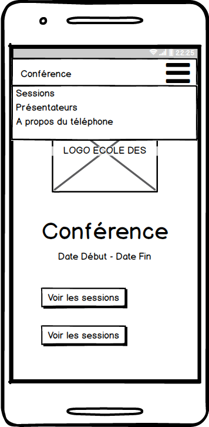
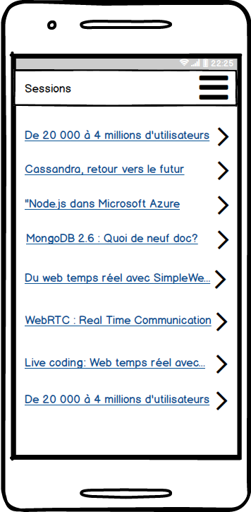
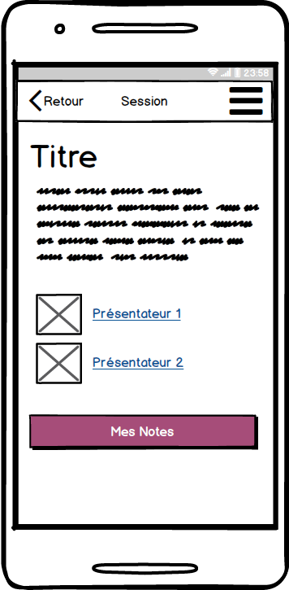
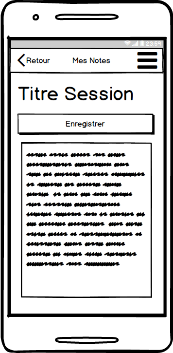
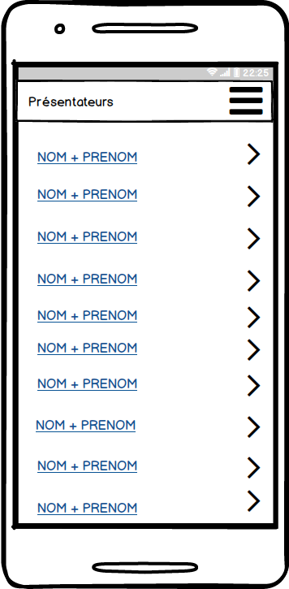
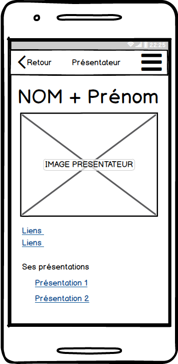

# Application

* Créer les différentes pages de l'application.

## Page d'accueil

Remarque sur les maquettes :

* Les boutons sont : "Voir les sessions" et "Voir les présentateurs".
* Le menu "A propos du téléphone" n'est pas nécessaire pour cet exercice.

## Liste des sessions

## Détails d'une session

Le bouton _Mes Notes_ conduit à une vue permettant de prendre des notes.

Stocker les notes dans le _LocalStorage_.

## Vues présentateurs

