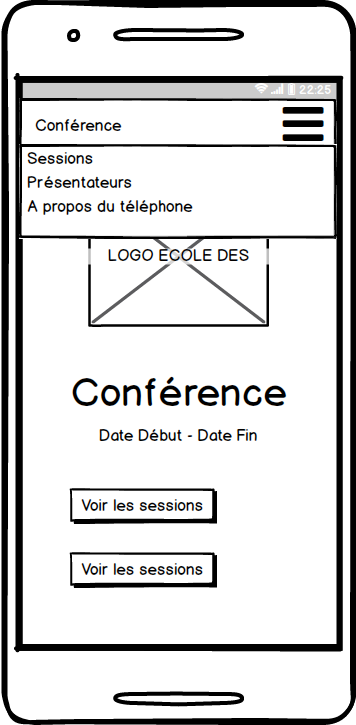

# Workshop TypeScript

* Version en ligne : http://www.dev-institut.fr/workshop-typescript
* Contribuer : https://github.com/DevInstitut/workshop-typescript

## Contexte
(en cours de rédaction)

## Objectif

L'objectif de ce TP est de construire une application permettant de visualiser les données d'une conférence (_BreizhCamp 2018_).

Une erreur s'est glissée dans la maquette : il manque le bouton `Voir les présentateurs`.

Cette construction se fera par la mise en place de _techniques_ souvent utilisées par les frameworks Web :

* Templating
* Routeur
* Consommation d'API REST
* Stockage local
* ...

## Un mot sur l'auteur

<table>
    <tbody>
        <tr>
            <td></td>
            <td>Rossi Oddet est fondateur de <a href="http://www.dev-institut.fr">Dev Institut</a>, organisme de formation professionnelle de développeurs.
            Il co-organise également des formations Data à travers l'initiative <a href="http://www.ml-week.com/">ML Week</a>.</td>
        </tr>
        <tr>
            <td>Contact</td>
            <td>rossi.oddet@dev-institut.fr</td>
        </tr>
    </tbody>
</table>